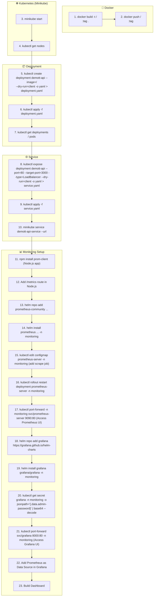

# 🐳 Kubernetes (Minikube + Prometheus + Grafana) — Beginner Notes

---

## 🔹 0. Prerequisites

Before jumping into Kubernetes:

* **Install Docker** → build and push images.
* **Install kubectl** → CLI to interact with cluster.
* **Install Minikube** → run Kubernetes locally.
* **Install Helm** → package manager for Kubernetes.

---

## 🔹 1. Docker Basics

### 1.1 Build Docker Image

Create a `Dockerfile` for Node.js app:

```dockerfile
FROM node:18-alpine

WORKDIR /usr/src/app
COPY package*.json ./
RUN npm install --production
COPY . .

EXPOSE 3000
CMD ["node", "index.js"]
```

Build & tag image:

```bash
docker build -t ray0906/k8s-demott:latest .
```

### 1.2 Run Container Locally

```bash
docker run -p 3000:3000 ray0906/k8s-demott:latest
```

* Access app at → `http://localhost:3000`

### 1.3 Push Image to Docker Hub

```bash
docker login
docker push ray0906/k8s-demott:latest
```

This image will be used inside Kubernetes.

---

## 🔹 2. Start Kubernetes Cluster (Minikube)

Start:

```bash
minikube start
```

Check:

```bash
kubectl get nodes
```

> Minikube runs a **single-node cluster** (acts as both Master + Worker).

---

## 🔹 3. Deploy Application

### 3.1 Create Deployment

```bash
kubectl create deployment demott-api \
  --image=ray0906/k8s-demott:latest \
  --dry-run=client -o yaml > deployment.yaml
```

Apply:

```bash
kubectl apply -f deployment.yaml
```

Deployment manages:

* **Pods** (running app containers).
* **ReplicaSet** (ensures desired number of Pods).

Check:

```bash
kubectl get deployments
kubectl get pods
```

---

## 🔹 4. Expose Application (Service)

### 4.1 Create Service

```bash
kubectl expose deployment demott-api \
  --port=80 --target-port=3000 \
  --type=LoadBalancer \
  --dry-run=client -o yaml > service.yaml
```

Apply:

```bash
kubectl apply -f service.yaml
```

Service Types:

* **ClusterIP** (default, internal only).
* **NodePort** (exposes app on node's IP & port).
* **LoadBalancer** (exposes app externally, Minikube simulates this).

### 4.2 Access Service

```bash
minikube service demott-api-service --url
```

Check all resources:

```bash
kubectl get all
```

---

## 🔹 5. Logs & Debugging

* Logs from a Pod:

```bash
kubectl logs <pod-name>
```

* Describe a resource:

```bash
kubectl describe pod <pod-name>
```

* Port forward directly:

```bash
kubectl port-forward pod/<pod-name> 4000:3000
```

---

## 🔹 6. Monitoring Setup

### 6.1 Add Metrics in Node.js App

Install:

```bash
npm install prom-client
```

Code:

```js
import client from 'prom-client';
const collectDefaultMetrics = client.collectDefaultMetrics;
collectDefaultMetrics({ timeout: 5000 });

app.get('/metrics', async (req, res) => {
  res.set('Content-Type', client.register.contentType);
  res.end(await client.register.metrics());
});
```

---

### 6.2 Install Prometheus (Helm)

```bash
helm repo add prometheus-community https://prometheus-community.github.io/helm-charts

helm install prometheus prometheus-community/prometheus \
  --namespace monitoring \
  --create-namespace \
  --set server.service.type=NodePort \
  --set server.service.nodePort=30000 \
  --set alertmanager.enabled=false
```

Check resources:

```bash
kubectl get all -n monitoring
```

#### Add Scrape Job for Node.js App

```bash
kubectl edit configmap prometheus-server -n monitoring
```

Add under `scrape_configs`:

```yaml
- job_name: 'node-app'
  static_configs:
    - targets: ['demott-api-service.default.svc.cluster.local:80']
```

Restart:

```bash
kubectl rollout restart deployment prometheus-server -n monitoring
```

Access Prometheus:

```bash
kubectl port-forward -n monitoring svc/prometheus-server 9090:80
```

→ [http://localhost:9090](http://localhost:9090)

---

### 6.3 Install Grafana (Helm)

```bash
helm repo add grafana https://grafana.github.io/helm-charts
helm repo update

helm install grafana grafana/grafana \
  --namespace monitoring \
  --create-namespace \
  --set service.type=NodePort \
  --set service.nodePort=30091 \
  --set persistence.enabled=false
```

Get Admin Password:

```bash
kubectl get secret grafana -n monitoring -o jsonpath="{.data.admin-password}" | base64 --decode
```

Access Grafana:

```bash
kubectl port-forward svc/grafana 8000:80 -n monitoring
```

→ [http://localhost:8000](http://localhost:8000)

Login:

* User: `admin`
* Pass: (from secret above)

---

### 6.4 Connect Grafana → Prometheus

1. In Grafana, go to **Data Sources** → Add Prometheus.
2. URL: `http://prometheus-server.monitoring.svc.cluster.local:80`
3. Save & Test.
4. Import dashboard or build one manually.

---

## 🔹 7. Kubernetes Workflow Recap

1. **Build Docker Image** → Push to Docker Hub.
2. **Start Minikube Cluster**.
3. **Create Deployment** (runs Pods with ReplicaSets).
4. **Create Service** (expose Pods).
5. **Access Application** via `minikube service`.
6. **Add Monitoring** with Prometheus (scrape metrics).
7. **Visualize Metrics** in Grafana.

---

## 🔹 8. Useful Commands

* Scale Deployment:

```bash
kubectl scale deployment demott-api --replicas=5
```

* Delete Resources:

```bash
kubectl delete -f deployment.yaml
kubectl delete -f service.yaml
```

* Get YAML of any resource:

```bash
kubectl get deployment demott-api -o yaml
```

---

📌 **Big Picture Diagram (mental model):**

```
[ Docker Image ] → [ Deployment ] → [ Pods (Containers) ]
                                ↓
                          [ Service (LB) ]
                                ↓
                    Access App via Minikube URL
                                ↓
 [ Prometheus ] ← Scrapes metrics from Pods/Service
                                ↓
          [ Grafana ] → Dashboards / Visualizations
```

---

## 🔹 9. Quick Reference Cheat Sheet

| Command | Purpose |
|---------|---------|
| `minikube start` | Start local Kubernetes cluster |
| `kubectl get nodes` | Check cluster nodes |
| `kubectl get pods` | List running pods |
| `kubectl get deployments` | List deployments |
| `kubectl get services` | List services |
| `kubectl get all` | Show all resources |
| `kubectl apply -f <file>` | Deploy resources from YAML |
| `kubectl delete -f <file>` | Remove resources from YAML |
| `kubectl logs <pod-name>` | View pod logs |
| `kubectl describe <resource> <name>` | Get detailed resource info |
| `kubectl port-forward <pod> <local>:<remote>` | Forward port to local machine |
| `kubectl scale deployment <name> --replicas=<n>` | Scale deployment |
| `minikube service <service-name> --url` | Get service URL |
| `helm install <name> <chart>` | Install Helm chart |
| `helm list` | List installed charts |

---

# 📑 Kubernetes & Docker Detailed Cheat Sheet

| **Step**                       | **Command**                                                                                                                 | **Purpose**                    |
| ------------------------------ | --------------------------------------------------------------------------------------------------------------------------- | ------------------------------ |
| **🔹 Docker**                  | `docker build -t <image-name>:tag .`                                                                                        | Build image from Dockerfile    |
|                                | `docker run -p 3000:3000 <image-name>`                                                                                      | Run container locally          |
|                                | `docker push <dockerhub-username>/<image>:tag`                                                                              | Push image to Docker Hub       |
| **🔹 Cluster (Minikube)**      | `minikube start`                                                                                                            | Start local Kubernetes cluster |
|                                | `kubectl get nodes`                                                                                                         | Check if node is running       |
| **🔹 Deployment**              | `kubectl create deployment <name> --image=<image> --dry-run=client -o yaml > deployment.yaml`                               | Create Deployment YAML         |
|                                | `kubectl apply -f deployment.yaml`                                                                                          | Apply Deployment               |
|                                | `kubectl get deployments`                                                                                                   | Check deployments              |
|                                | `kubectl get pods`                                                                                                          | List pods                      |
|                                | `kubectl logs <pod-name>`                                                                                                   | View pod logs                  |
|                                | `kubectl describe pod <pod-name>`                                                                                           | Detailed pod info              |
|                                | `kubectl scale deployment <name> --replicas=5`                                                                              | Scale replicas                 |
| **🔹 Service**                 | `kubectl expose deployment <name> --port=80 --target-port=3000 --type=LoadBalancer --dry-run=client -o yaml > service.yaml` | Create Service YAML            |
|                                | `kubectl apply -f service.yaml`                                                                                             | Apply Service                  |
|                                | `kubectl get svc`                                                                                                           | List services                  |
|                                | `minikube service <service-name> --url`                                                                                     | Get external URL               |
| **🔹 Monitoring (Prometheus)** | `helm repo add prometheus-community https://prometheus-community.github.io/helm-charts`                                     | Add Prometheus repo            |
|                                | `helm install prometheus prometheus-community/prometheus -n monitoring --create-namespace`                                  | Install Prometheus             |
|                                | `kubectl edit configmap prometheus-server -n monitoring`                                                                    | Edit config to add scrape job  |
|                                | `kubectl rollout restart deployment prometheus-server -n monitoring`                                                        | Restart Prometheus             |
|                                | `kubectl port-forward -n monitoring svc/prometheus-server 9090:80`                                                          | Access Prometheus locally      |
| **🔹 Monitoring (Grafana)**    | `helm repo add grafana https://grafana.github.io/helm-charts`                                                               | Add Grafana repo               |
|                                | `helm install grafana grafana/grafana -n monitoring --create-namespace`                                                     | Install Grafana                |
|                                | `kubectl get secret grafana -n monitoring -o jsonpath="{.data.admin-password}" \| base64 --decode`                        | Get Grafana password           |
|                                | `kubectl port-forward svc/grafana 8000:80 -n monitoring`                                                                    | Access Grafana locally         |
| **🔹 Cleanup**                 | `kubectl delete -f deployment.yaml`                                                                                         | Delete Deployment              |
|                                | `kubectl delete -f service.yaml`                                                                                            | Delete Service                 |
|                                | `minikube stop`                                                                                                             | Stop cluster                   |
|                                | `minikube delete`                                                                                                           | Delete cluster                 |

---

⚡ **Quick Flow to Remember:**
**Docker build → Push to Hub → Minikube start → Create Deployment → Expose Service → Monitor with Prometheus → Visualize in Grafana**

---

## 🔹 10. Visual Workflow Diagram

```mermaid
flowchart TD

    subgraph Dev["💻 Developer Machine"]
        A[Dockerfile] --> B[Docker Build]
        B --> C[Docker Image]
        C --> D[Docker Hub 🐳]
    end

    subgraph K8s["☸️ Kubernetes (Minikube Cluster)"]
        D --> E[Deployment]
        E --> F[ReplicaSet]
        F --> G[Pods (Containers)]
        G --> H[Service (LoadBalancer)]
    end

    H --> I[User Access via Minikube URL]

    subgraph Monitoring["📊 Monitoring"]
        G --> J[Prometheus <br> Scrapes /metrics]
        J --> K[Grafana <br> Dashboards]
        K --> L[Visualize Metrics]
    end
```

### 📝 How this works:

* **Dockerfile → Docker Image → Docker Hub** → store the app image.
* **Deployment → ReplicaSet → Pods** → Kubernetes runs app in pods.
* **Service (LoadBalancer)** → exposes pods to external world.
* **Prometheus** scrapes `/metrics` endpoint of Node.js app.
* **Grafana** connects to Prometheus → visualize metrics on dashboards.

---

## 🔹 11. Step-by-Step Command Execution Flow



### 📌 What this shows:

* **Docker Phase** → Build & push image.
* **Kubernetes Phase** → Start cluster, create deployment, expose service.
* **Monitoring Phase** → Add Prometheus & Grafana, scrape metrics, build dashboards.

---

👉 This covers **Docker → Kubernetes basics → Monitoring**.  
Perfect for learning Kubernetes step by step with hands-on examples!